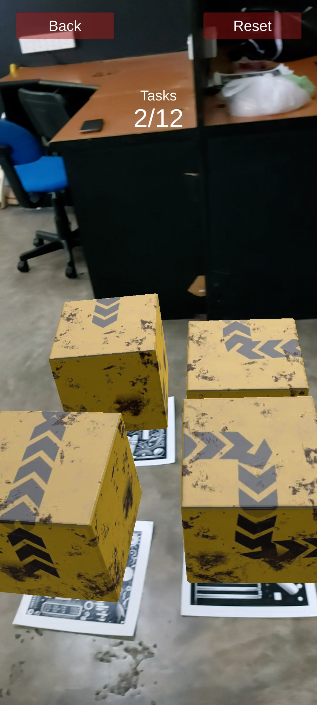
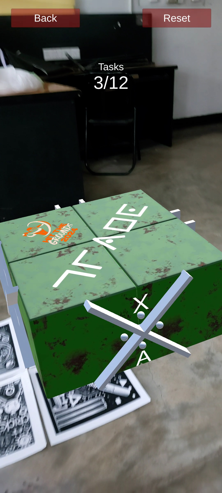
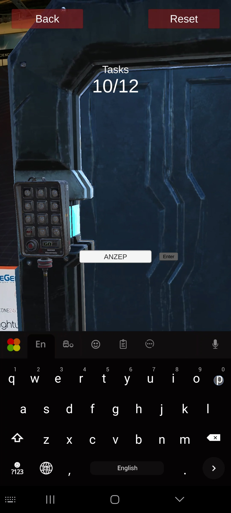
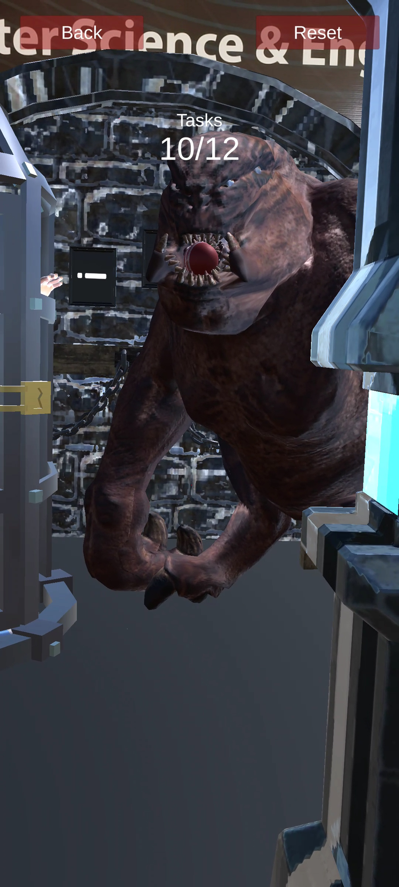
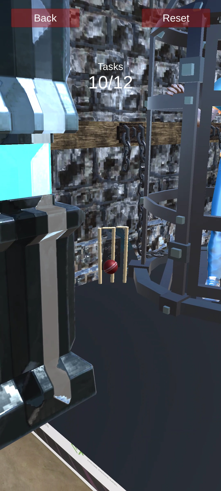
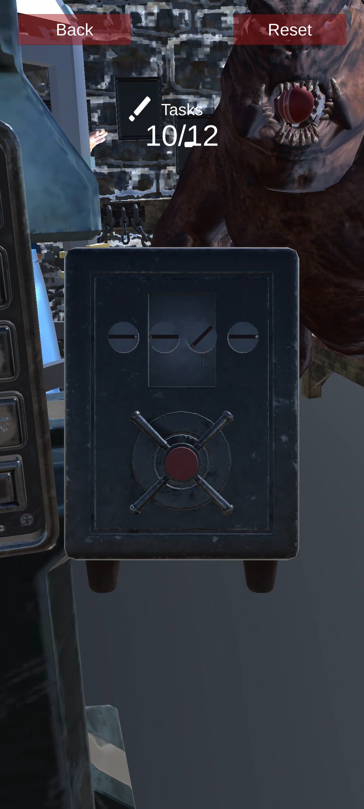
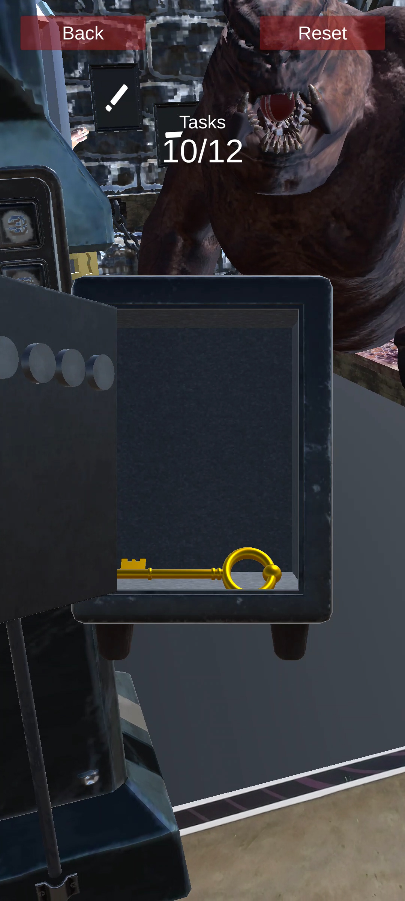
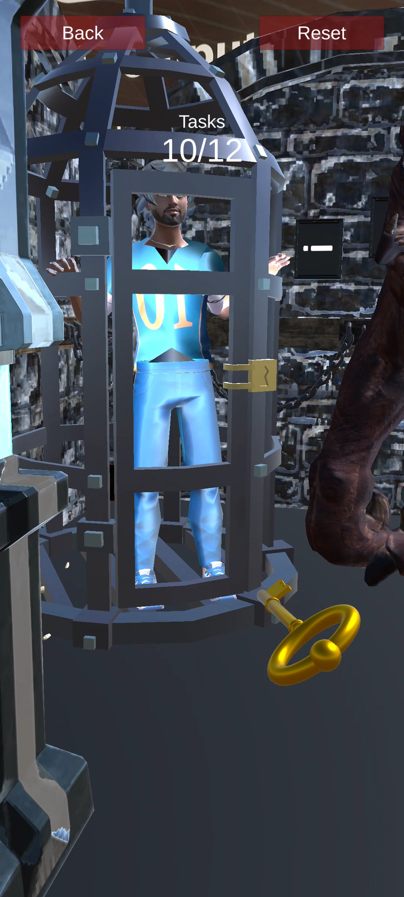

# HitTheGroundScav  

**HitTheGroundScav** is a multi-level, highly interactive AR scavenger hunt puzzle game developed using **Unity** and **Vuforia**. The game was designed as a sub-event for the "Hit The Grounds" Cricket event, combining immersive AR elements and engaging puzzles.  

---

## Game Levels  

1. **Solve the 3D Puzzle**  
   - Arrange anchor images correctly to solve the puzzle.  
   -   

2. **Solve the Pig Pen Puzzle**  
   - Complete the Pig Pen puzzle that appears after solving the first puzzle.  
   -   

3. **Unlock the Door**  
   - Use the Pig Pen solution as a password to open the door to a hidden room.  
   -   

4. **Retrieve the Cricket Ball**  
   - Find and click on the cricket ball hidden in the monster’s mouth.  
   -   

5. **Aim and Hit the Wickets**  
   - Throw the cricket ball to hit the wickets and reveal a hidden hole in the wall.  
   -   

6. **Retrieve the Safe**  
   - Pick up the safe hidden in the wall by clicking on it.  
   -   

7. **Unlock the Safe**  
   - Use the photos hanging on the wall as clues to unlock the safe.  
   -   

8. **Rescue the Trapped Player**  
   - Use the golden key from the safe to unlock the golden lock and rescue the cricket player trapped in the room.  
   -   

---

## Unique Features  

- **Dynamic Puzzle Solutions**:  
  All puzzle values and solutions are randomized based on the player's session ID at login, ensuring a unique experience for each player.  

---

## Demo Video  

  
*Click the thumbnail to watch the demo video!*  

---

## Installation & Requirements  

- **Unity**: Version 2020.3 or higher.  
- **Vuforia**: For AR integration.  
- **Device**: Android/iOS device with AR compatibility.  

---

## How to Play  

1. Launch the game and log in.  
2. Start solving the puzzles in sequence as they appear.  
3. Use clues, logic, and accuracy to complete all levels and rescue the cricket player.  

---

For any issues or contributions, feel free to raise an issue or pull request in this repository. Enjoy the game! 🏏  
